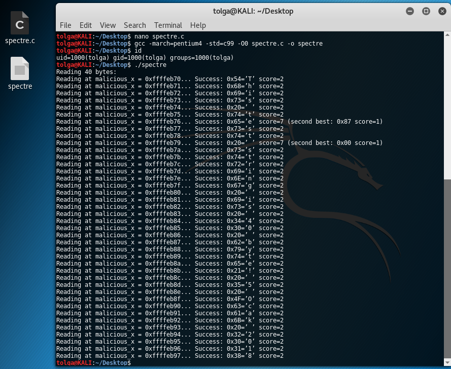

# SpectreCompiled
Meltdown and Spectre Vuln PoC Compiled

$ gcc -march=pentium4 -std=c99 -O0 spectre.c -o spectre

$ ./spectre

Patched;

"#define CACHE_HIT_THRESHOLD(80) -> #define CACHE_HIT_THRESHOLD (80)"

"?" -> '?'
